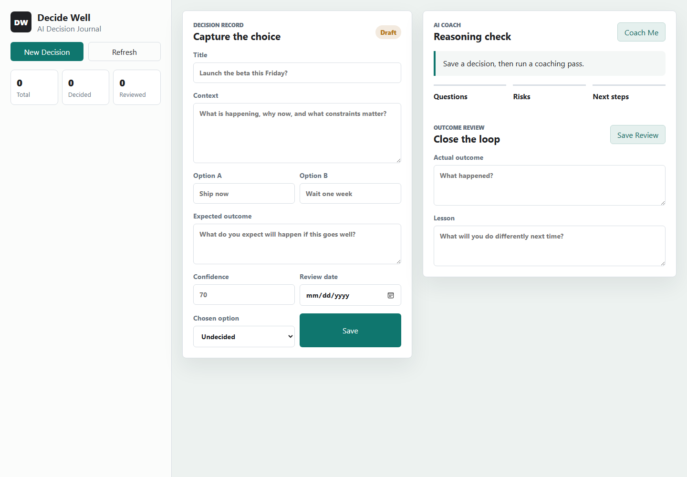
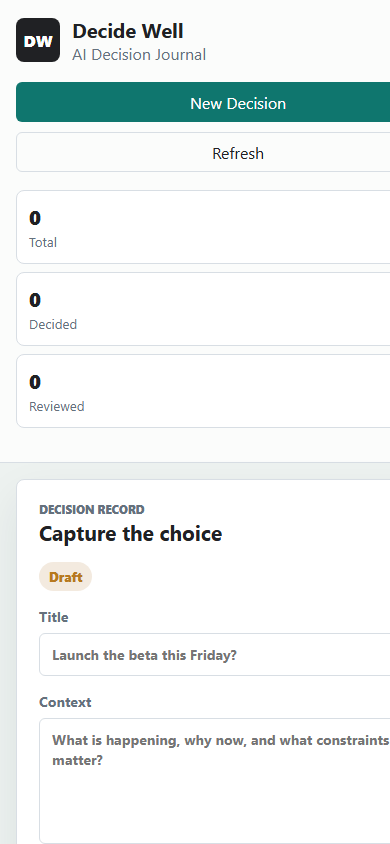

# Decide Well

Decide Well is an AI Decision Journal for slowing down important choices, recording your reasoning, and reviewing outcomes later. It turns a generic chatbot starter into a focused product: capture the decision, compare options, get a coaching pass, commit with a confidence score, and come back later to learn from what happened.

## Screenshots

### Desktop



### Mobile



## Features

- Create decision records with context, options, confidence, expected outcome, and review date.
- Save the option you chose and mark the decision as decided.
- Run an AI coaching pass for clarifying questions, risks, and next steps.
- Fall back to offline coaching prompts if the OpenAI API is unavailable or rate-limited.
- Review actual outcomes and lessons learned.
- Store decisions in MongoDB.
- Serve the frontend and API from one Express app.

## Tech Stack

- Node.js
- TypeScript
- Express
- MongoDB and Mongoose
- OpenAI Responses API
- Static HTML, CSS, and JavaScript frontend

## Getting Started

Install dependencies:

```bash
npm install
```

Create your local environment file:

```bash
cp .env.example .env
```

Add your real environment values to `.env`:

```bash
MONGODB_URL=mongodb://127.0.0.1:27017/ai-decision-journal
OPENAI_API_KEY=your_openai_api_key
OPENAI_MODEL=gpt-4.1-mini
PORT=5000
```

Build and run:

```bash
npm run build
npm start
```

Open the app:

```text
http://localhost:5000
```

## MongoDB

For local MongoDB:

```bash
MONGODB_URL=mongodb://127.0.0.1:27017/ai-decision-journal
```

For MongoDB Atlas, use the connection string from Atlas. If `mongodb+srv://` causes DNS issues on your machine, use the standard `mongodb://` replica-set string with the shard hosts, `ssl=true`, `authSource=admin`, and the Atlas replica set name.

## OpenAI

`OPENAI_API_KEY` is optional for local testing. If it is missing, or if OpenAI returns a quota/rate-limit response, the app still saves an offline coaching pass so the journal remains usable.

## Development

Run TypeScript in watch mode and restart the server with Nodemon:

```bash
npm run dev
```

Build the app:

```bash
npm run build
```

Run a production-style local server:

```bash
npm start
```

## Secret Safety

- Keep real credentials only in `.env`.
- Do not commit `.env`; it is ignored by git.
- Commit `.env.example` only with placeholders or local non-secret defaults.
- Rotate any MongoDB or OpenAI key that was pasted into chat, logs, screenshots, or git history.
- Use a restricted MongoDB database user for this app instead of an admin user.
- In MongoDB Atlas, restrict Network Access to your IP while developing.

## Project Structure

```text
public/
  app.js
  index.html
  styles.css
src/
  app.ts
  config/env.ts
  db/connection.ts
  index.ts
  models/Decision.ts
  routes/decisionRoutes.ts
  services/decisionCoach.ts
docs/
  screenshots/
```
